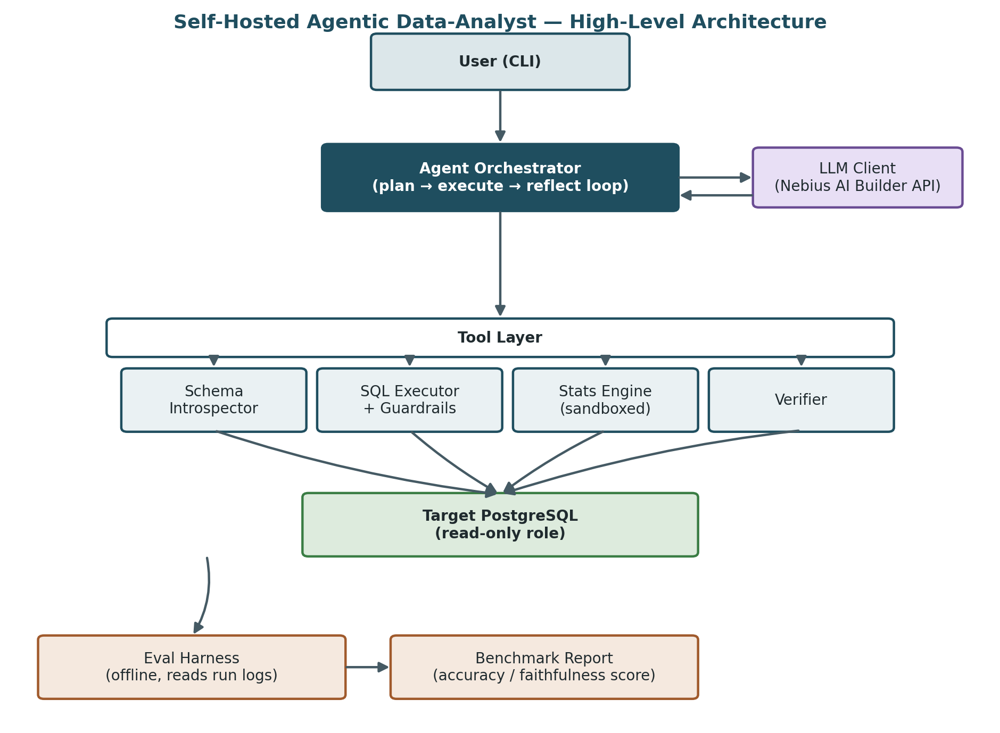
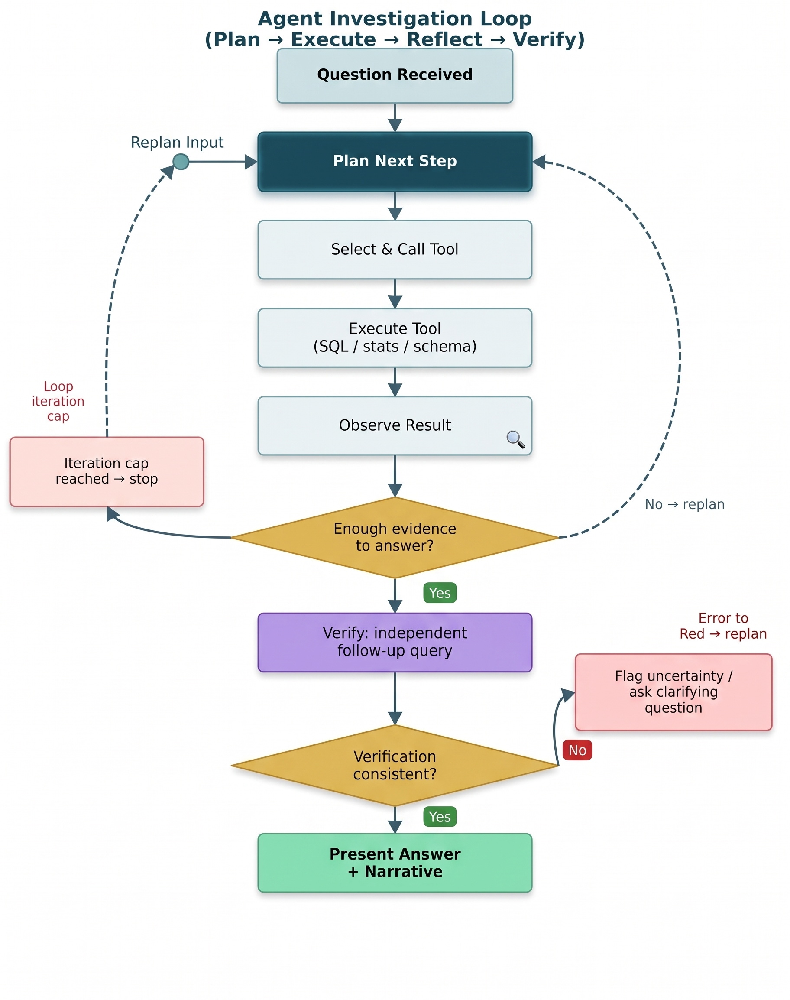

# ai-analyst-agent

Self-hosted CLI agent that answers natural-language questions over PostgreSQL by **investigating** with SQL/stats tools, then **verifying** before it answers — not by emitting one-shot text-to-SQL.

## Why not single-shot text-to-SQL?

Most “ask your database” demos generate one query and trust the result. This agent is built around a bounded **plan → execute → reflect** loop: it gathers evidence across steps, can ask for clarification when the question is underspecified, and runs an **independent verification query** before presenting a narrative. Wrong guesses and unbounded retries are design failures, not features.

## Quickstart

```bash
git clone https://github.com/Aadigha-git/ai-analyst-agent.git
cd ai-analyst-agent

python -m venv .venv && source .venv/bin/activate
pip install -r requirements.txt

cp .env.example .env
# set LLM_PROVIDER (default: nebius) and its matching API key
# (NEBIUS_API_KEY / OPENAI_API_KEY / ANTHROPIC_API_KEY / GOOGLE_API_KEY)

docker compose up -d db   # demo DB only — skip if using your own Postgres
python -m src.cli ask "Which region had the most orders in January 2025?"
```

Add `--verbose` to print underlying SQL and the tool trace.

## Connecting to Your Own Database

`docker compose up -d db` starts a **demo/seeded** Postgres instance for local eval and Quickstart only. Intended real usage is pointing the agent at **your** PostgreSQL database.

1. Run [`scripts/create_readonly_role.sql`](scripts/create_readonly_role.sql) against **each** target database (required for every new database — not a one-time global setup).
2. Set `READONLY_DATABASE_URL` (and optionally `DATABASE_URL` for admin/setup) in `.env` to that read-only role’s connection string.
3. Skip `docker compose up -d db` entirely if you are not using the sample data.

**Warning:** The read-only Postgres role is what enforces the “never writes” guarantee. Running the agent with a write-capable role defeats that guarantee regardless of application-level SELECT checks.

## Architecture

**HLD** — CLI → orchestrator ↔ pluggable LLM provider → tool layer → read-only Postgres; offline eval harness scores runs.



**LLD** — investigation loop with iteration cap and verify-before-answer.



More detail: [`docs/API.md`](docs/API.md), [`docs/DECISIONS.md`](docs/DECISIONS.md), [`docs/DB.md`](docs/DB.md).

## Evaluation

Latest full benchmark: **[10/12](eval/results/report.md)** on the v1.0 12-question seeded-DB suite (see `eval/benchmark_questions.json`). The expanded v2 suite lives in `eval/benchmark_v2.json` (30 questions).

## CI

Pull requests run two gates:

- **Unit CI** (`.github/workflows/ci.yml` `test` job): lint + pytest against a seeded Postgres service. No live LLM calls (provider key is a placeholder).
- **Smoke regression** (`eval-smoke` job): runs `eval/run_smoke.py` on a fixed 5-question subset (`eval/smoke_subset.json`) with a **real** default-provider LLM call and fails if the score drops below `eval/results/smoke_baseline.json`. Requires repository secret `NEBIUS_API_KEY` (or the matching key if `LLM_PROVIDER` is changed). Update the baseline only manually via `python eval/run_smoke.py --update-baseline` — never from CI.

The full ~30-question v2 benchmark remains a **manual / nightly** run (`python eval/eval_harness.py --benchmark eval/benchmark_v2.json`), not a PR blocker.

## Known Limitations

Pulled from the latest eval report:

- **BQ-07 (multi-step MoM growth):** Correctly names **Central** but often omits growth magnitude (+6) and month pair in the draft answer. Drafts are not yet required to include the supporting scalar(s) the rubric checks.
- **BQ-11 (trap — Electronics revenue without time window):** Returns the correct all-time total without clarifying or stating the all-dates assumption. Open-ended totals still tend to silent defaults; full fix vs over-clarifying well-scoped questions remains an open tension.
